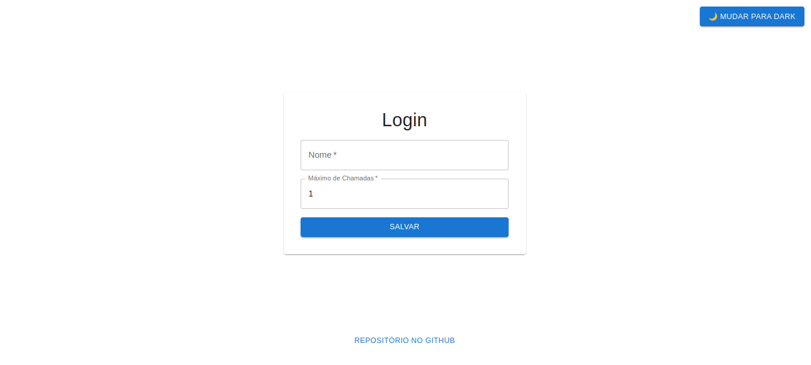
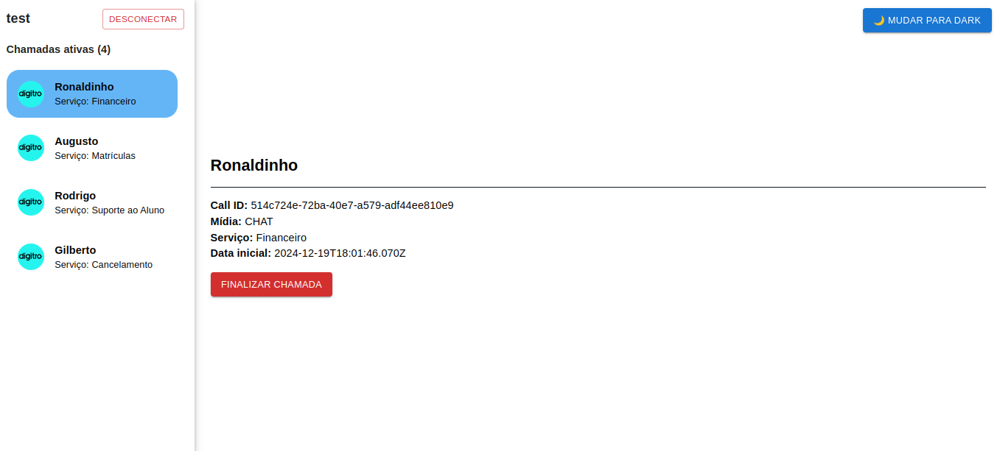
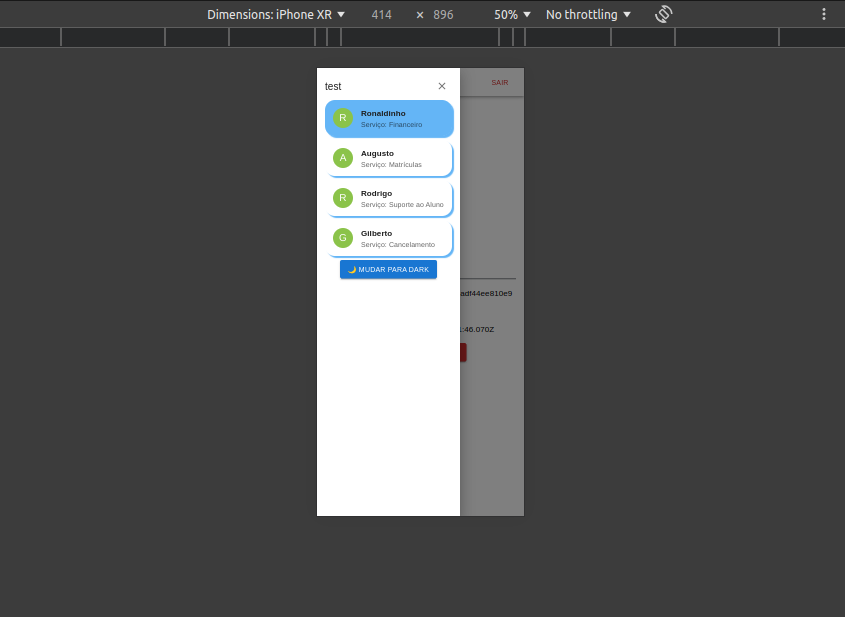

# Front-end Project Documentation

## Overview
This is a modern web application built with Vite + TypeScript + Material UI, providing a fast and efficient development experience. The project uses component architecture and file-based routing system to create a performant website.

### Key Directories and Files

- `src/components/`: Contains reusable Astro components
- `src/layouts/`: Contains layout templates
- `src/pages/`: Contains all page components
  - `home.tsx`: The home page of the application
  - `auth.tsx`: The authentication page
- `public/`: Static assets directory

## 🛠️ Technologies Used

- VITE - For fast development and testing
- TypeScript - For type-safe JavaScript development
- Material UI - For styling with modern features
- ESLint - For code linting and formatting
- Prettier - For code formatting

## 🚀 Getting Started

1. Clone the repository:
```bash
git clone https://github.com/igorfelixx/front-end.git
```

2. Install dependencies:
```bash
npm install
```

3. Start the development server:
```bash
npm run dev
```

4. Open your browser and visit `http://localhost:xxxx`

## 📝 Available Scripts

- `npm run dev` - Starts the development server
- `npm run build` - Creates a production build
- `npm run preview` - Previews the production build locally

## 🚀🚀🚀 The Project





## 🎨 Styling

The project uses a custom styling system with:
- CSS Variables for theming
- Global styles defined in the Layout component
- Component-scoped styles
- Responsive design principles

### Color Theme Variables

```css
:root {
  --accent: 136, 58, 234;
  --accent-light: 224, 204, 250;
  --accent-dark: 49, 10, 101;
  --accent-gradient: linear-gradient(
    45deg,
    rgb(var(--accent)),
    rgb(var(--accent-light)) 30%,
    white 60%
  );
}
```

## 🧩 Components

### Card Component
A reusable card component with:
- Hover effects
- Gradient backgrounds
- Responsive design
- Accessible markup

### Layout Component
The main layout wrapper that provides:
- Common HTML structure
- Meta tags
- Global styles
- Responsive viewport settings

## 🤝 Contributing

1. Fork the repository
2. Create a new branch
3. Make your changes
4. Submit a pull request

## 📄 License

This project is open source and available under the [MIT License](LICENSE).

## 👥 Contact

For questions or suggestions, please open an issue in the GitHub repository.
Email: euigorfelix@gmail.com